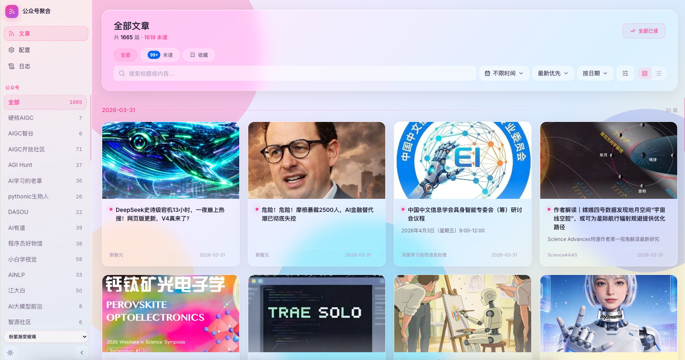

# WeChatOA_Aggregation

微信公众号聚合平台——爬取多个公众号的文章，在本地 Web 界面中进行筛选、过滤和阅读，可聚合多个公众号的优质文章统一阅读，AI 辅助分析。



---

## 快速启动

### 1. 环境准备

```bash
# 推荐使用 uv 管理环境
uv sync
```

### 2. 配置 token 与 cookie

在 `data/id_info.json` 中填入微信公众平台的 `token` 和 `cookie`：

```json
{
    "token": "xxxxxxxxx",
    "cookie": "xxxxxxxxx"
}
```

**获取方式：** 进入 [微信公众平台](https://mp.weixin.qq.com)，扫码登录后地址栏末尾可看到 `token=xxxxxxxxx`；按 F12 → Network → Fetch/XHR，刷新页面，随意点开一个请求即可找到 `Cookie` 字段。

> **凭证过期：** token 或 cookie 过期时，前端管理页会展示警告横幅并提供**扫码登录**按钮——点击后后端在无头 Chrome 中加载登录页并截图显示到前端，用手机扫码后新的 token/cookie 自动写回 `data/id_info.json`，无需手动填写。

### 3. 大模型打标签（可选）

爬取到**新文章**时，若配置了 LLM 接口，会为每篇生成 `tags` 并写入 `message_info.json`，前端筛选栏与卡片可展示、过滤标签。

| 环境变量 | 说明 |
|----------|------|
| `QWEN35_27B_ENDPOINT` | 自部署或网关的 Chat Completions 兼容地址（POST JSON）。**未设置则跳过打标**，爬取与其它功能不受影响。 |
| `QWEN35_27B_API_KEY` 或 `LLM_API_KEY` | 可选；若设置则请求头携带 `Authorization: Bearer <密钥>`。 |
| `QWEN35_27B_MODEL` | 可选，默认 `Qwen3.5-27B`。 |

标签由一组**种子标签**（含 **「广告」**）与模型扩展组成；若正文明显为推广、带货、商务合作、营销软文，提示词要求模型必须打上「广告」。单次请求失败时该篇可能无标签，不影响爬取落盘。

### 4. 启动后端 API 服务

```bash
uv run uvicorn api:app --reload --port 8000
```

### 5. 启动前端

```bash
cd frontend
npm install
npm run dev
# 浏览器访问 http://localhost:5173
```

---

## 功能说明

### 前端界面

| 页面 / 功能模块 | 说明 |
|----------------|------|
| **文章信息流** | 卡片 / 列表两种视图；默认按日期分组展示；关键词搜索、公众号筛选、日期范围过滤、排序与分组切换；单篇删除（写入黑名单，再次爬取不会入库） |
| **已读 / 收藏** | 点击文章自动标为已读，支持收藏；FilterBar 提供「全部 / 未读 / 收藏」三个快速 Tab；已读文章降低透明度，未读文章显示蓝点标识 |
| **公众号管理** | 搜索并添加公众号（两步流程：搜索候选 → 确认添加）、移除公众号、控制各账号在文章流中的显示/隐藏 |
| **立即爬取** | 一键触发后端爬取任务；实时进度横幅展示当前账号与进度；凭证失效时立即终止并展示明确提示 |
| **清理缓存** | 按保留天数（30 / 60 / 90 / 180 天）预览并删除过期文章、封面图和详情缓存 |
| **操作日志** | 时间轴展示爬取、账号管理、缓存清理的历史记录，支持展开查看详细 JSON |
| **凭证状态** | 管理页顶部实时显示 token/cookie 状态（正常 / 可能过期 / 未配置）；点击「扫码登录」可在前端直接完成重新授权 |
| **主题切换** | 浅色 / 深色 / 跟随系统 |

### 爬虫与数据

- 支持按公众号 `fakeid` 批量拉取近一个月文章
- 基于 `msgid-aid-create_time` 组合 ID 增量去重，已爬取的文章不会重复写入
- 用户在前端删除的文章 id 记入 `deleted_article_ids.json`，后续爬取遇到该 id 直接跳过，不再入库
- 下载封面图到本地 `data/covers/`，规避微信 CDN 防盗链；超过 640px 自动等比缩放
- 爬取前自动做凭证预检（轻量探测请求），凭证失效时立即中止，不逐账号重试卡死
- 重要操作（爬取开始/完成/失败、添加/删除账号、清理缓存）自动写入 `data/operation_logs.jsonl`
- 使用 MinHash+LSH 算法对文章内容编码，识别并标记相似/重复文章（阈值 0.9，4005 条测试集准确率 100%）
- 可选：配置 `QWEN35_27B_ENDPOINT` 后，爬取新增的每篇文章会调用大模型生成 `tags`（见上文环境变量）；历史文章不会自动回填

### 技术栈

**前端：** Vue 3 · TypeScript · Vite · Tailwind CSS v4 · Pinia（含持久化）· Vue Router · lucide-vue-next

**后端：** FastAPI · uvicorn · Pillow · requests · DrissionPage

**数据：** 本地 JSON 文件（`data/`），无需数据库

---

## 目录结构

```
WeChatOA_Aggregation/
├── api.py                  # FastAPI 后端（账号管理、爬取、缓存清理、凭证、日志）
├── data/
│   ├── id_info.json        # 微信 token 和 cookie（需手动填写或扫码登录自动更新）
│   ├── name2fakeid.json    # 已添加的公众号列表
│   ├── message_info.json   # 所有公众号的文章数据
│   ├── deleted_article_ids.json  # 用户删除的文章 id，爬取时跳过
│   ├── covers/             # 本地缓存的文章封面图
│   └── operation_logs.jsonl # 操作日志
├── src/
│   ├── crawler/
│   │   └── wechat_request.py  # 微信爬虫核心（搜索账号、拉取文章、扫码登录）
│   └── llm/
│       ├── model_client.py    # Qwen3.5-27B 兼容 HTTP 调用（环境变量配置）
│       └── article_tagging.py # 爬取后为新文章打标签
└── frontend/
    └── src/
        ├── types/index.ts      # 全局 TypeScript 类型定义
        ├── stores/             # Pinia 状态管理
        │   ├── articles.ts     # 文章数据（从 JSON 文件加载）
        │   ├── reading.ts      # 已读 & 收藏（持久化到 localStorage）
        │   └── config.ts       # 用户配置：隐藏账号、主题（持久化）
        ├── composables/
        │   └── useFilters.ts   # 文章筛选/排序/分组逻辑
        ├── components/
        │   ├── articles/       # ArticleCard、ArticleRow、FilterBar
        │   ├── layout/         # AppSidebar、ThemeToggle
        │   └── ui/             # Dropdown、DateRangePicker
        └── views/
            ├── FeedView.vue    # 文章信息流主页
            ├── ConfigView.vue  # 公众号管理页
            └── LogView.vue     # 操作日志页
```

---

## 生产构建

```bash
cd frontend
npm run build
# 将 dist/ 目录部署，并把 ../data/*.json 复制到 dist/data/ 下
```

---

## TODO

### 爬虫 / 数据

- [x] 根据标题筛选可能相似博文，再获取具体内容计算重复率去重，去除大量转载文章
- [x] 使用 MinHash+LSH 算法对文章编码，去除重复文章
  - 0.9 阈值检测 528 篇重复文章，准确率 100%，召回率待测
- [ ] 使用向量编码模型对文章编码，进一步覆盖标题不同但内容相同的情况
  - 长文本准确率较低，待探索
- [x] 爬取次数限制：记录最新爬取时间，一天内已爬取则跳过，反复执行直到全部完成
- [x] cookie/token 过期：前端扫码登录，自动获取新凭证写回文件
- [x] 已爬取的文章定期检测是否已被删除
- [x] 下载封面图本地缓存，规避微信 CDN 防盗链
- [x] 爬取前凭证预检，失效时立即中止并提示，不逐账号卡死等待
- [x] 重要操作写入日志文件（JSONL 格式）
- [ ] 去除广告等无用博文
- [x] 请求频率限制时，切换代理 IP（免费代理不稳定，微信现已取消次数限制，暂搁置）
- [ ] **定时自动爬取**：在后端接入 APScheduler，配置每天固定时间自动触发，配置页提供开关和时间设置

### 前端 / 阅读体验

- [x] 现代化 Web 界面，支持公众号管理、文章筛选与预览
- [x] 封面图本地缓存，解决微信 CDN 防盗链问题
- [x] 操作日志页面（时间轴、按类型统计、展开详情）
- [x] 已读 / 未读标记 + 收藏功能（localStorage 持久化，支持筛选）
- [x] 默认按日期分组展示文章，最新在上
- [x] 凭证状态横幅 + 前端扫码登录弹窗
- [ ] **统计图表**：各公众号发文频率趋势、全局文章增长曲线（ECharts / Chart.js）
- [ ] **批量补下载封面**：对历史文章中缺失本地封面的条目一键补全下载
- [ ] **数据导出**：将筛选结果导出为 Markdown / CSV / JSON
- [ ] **PWA 支持**：添加 manifest.json，可安装到手机主屏幕作为轻量阅读器使用

### LLM 集成（前端占位符已预留）

- [x] **自动打标签**：爬取后调用 Qwen3.5-27B 兼容接口（`QWEN35_27B_ENDPOINT`）为新文章生成 `tags`，写回 `message_info.json`
- [ ] **摘要**：为新文章生成 `summary`（可与打标签共用同一 LLM 配置）
- [ ] **语义搜索**：对文章内容做向量化，支持自然语言检索

### 部署

- [x] GitHub Pages 搭建个人博客，将公众号聚合平台部署上去（简易版）：https://zejuncao.github.io/
- [x] 支持站内搜索
- [x] token/cookie 过期前端提醒，扫码重新登录引导
- [ ] **Docker 一键部署**：将后端和前端打包为 Docker Compose，简化本地/服务器部署流程

---

## MinHash 实验记录

在 4005 条博文的测试集下的去重实验（`minhash_0.9` 代表 MinHashLSH 阈值为 0.9）：

| 方法 | 检测重复个数 | 错误个数 |
|------|------------|---------|
| minhash_0.9 | 528 | 0 |
| minhash_0.8 | 699 | 24 |
| minhash_0.8 + 规则 0.7 | 665 | 1（文字很少，主体为图片） |

---

## 类似项目参考

- [wechat-article-exporter](https://github.com/jooooock/wechat-article-exporter)
- [WeChat_Article](https://github.com/1061700625/WeChat_Article)


## TODO

1. 点击添加公众号，光标直接到输入框
2. 选中一个公众号添加完之后，返回到添加界面，继续添加下一个
3. 每日爬取的时候，第二条0/N直接显示爬取第一个名字，而不是立即爬取然后等一会才出第一个名字